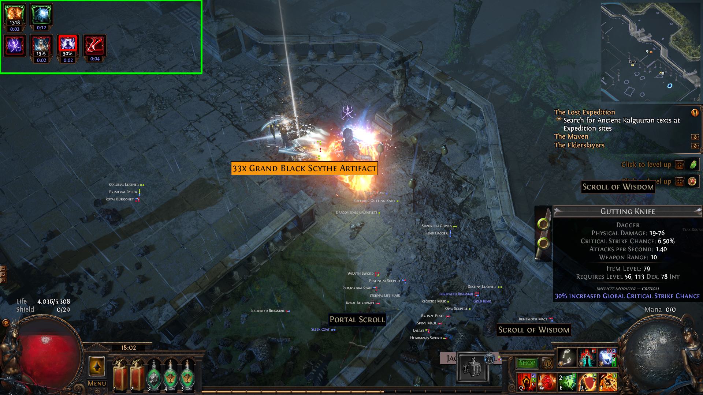

# PoEDebuffTracker

This tool tracks and automatically removes negative effects on your character in the online ARPG called 'Path of Exile'.
This implementation does not involve any AI. This means it is highly performant but does not work with different
resoultions ouf of the box. Currently only a resolution of 1920 * 1080 is supported.

Python version: 3.8.11

This repository includes:
* A requirements.txt file which includes all dependencies
* All code to get the tool running
* [Template images](resources/debuff_templates) for negative status effect
* An extensive [technical documentation](docs/_build/html/index.html)
* [Unittests](tests)

<b>How to run this tool</b>:
* Adapt your bindings to effects that must tracked be removed in [resources/config.toml](resources/config.toml)
* This tool already covers the most important removable effects. You can add more effects by adding an image
of the debuff to [resources/debuff_templates](resources/debuff_templates) and name it effectname.png.
Effectname must be the same in [resources/config.toml](resources/config.toml)
* Start [debufftracker/main.py](debufftracker/main.py)

Important: This tool's templates currently only work with a screen resoultion of 1920 * 1080. If you use a different
resolution you might have to create your own debuff templates (as NO AI for object detection is involved).

<b>How it works</b>:
* Tools grabs your screen every second and checks if it find one of the effects where remove_debuff is true in
[resources/config.toml](resources/config.toml)
* If a debuff is found, it will be removed by using the configured key
* This tool will only check the configured area of your screen for negative effects
This area is marked by a green rectangle. The detected negative effect is marked by a red rectangle.
